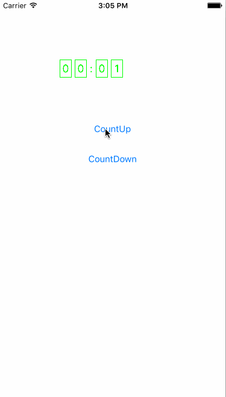

# MYScrollTimerView
A custom view like a digital clock, can use it for count or countdown.



## Usage

```objc
	
	//1.initialize
	
	MYScrollTimerView* timerView = [[MYScrollTimerView alloc]initWithFrame:CGRectMake(100, 100, 100, 30)];
    timerView.borderColor = [UIColor greenColor];
    timerView.numberColor = [UIColor greenColor];
    timerView.delegate = self;
    [self.view addSubview:timerView];
    self.timerView = timerView;
    
    //2.setting mode and total time
    [self.timerView setTotalTime:arc4random()%600
                withCountingMode:MYScrollTimerViewModeCountingUp
                     finishBlock:^(NSTimeInterval totalTime) {
                         
                     }];
     
     //3.start mothod
     [self.timerView start];
     
     //4.delegate call back
     - (void)scrollTimerView:(MYScrollTimerView *)timerView countingTo:(NSTimeInterval)time
		{
		    NSLog(@"current time is %f",time);
		}
                     
```